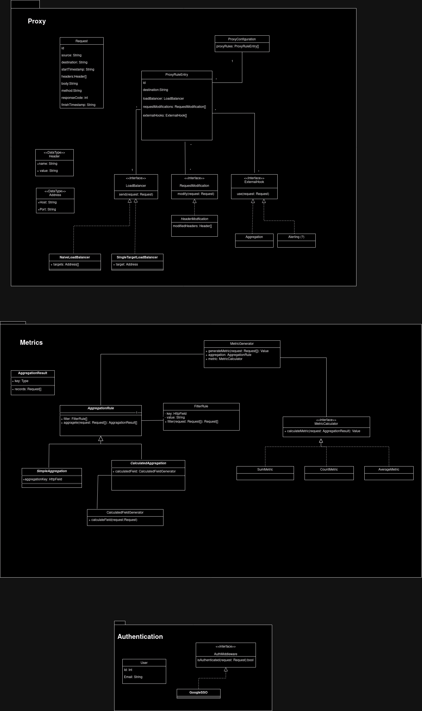

# Relay Beaver (_Web-Managed Reverse Proxy_)

## Opis tematu

Celem projektu jest stworzenie narzędzia do proxowania/debugowania/analizowania ruchu HTTP/HTTPS
w oparciu o konfigurację dostępną w panelu webowym.

Projekt ten składa się z czterech głównych komponentów:

- **Proxy** - wydajny serwer HTTP/HTTPS, który przekierowuje ruch do serwerów docelowych
- **Konfiguracja routingu** - panel webowy, który pozwala na dodawanie, usuwanie i modyfikowanie reguł proxy
  (np. zmiana nagłówków HTTP, load-balancing, etc.)
- **Logowanie/Debugowanie ruchu** - moduł który pozwala na przeglądanie ruchu przechodzącego
  przez proxy w czasie rzeczywistym i powtarzanie wybranych żądań.
- **Analityka** - moduł który agreguje informacje o ruchu i pozwala na ich analizę w ramach panelu webowego

## Przesłanka biznesowa

W przypadku skomplikowanych systemów do których ruch jest kierowany przez reverse proxy,
często wygodną alternatywą zmiany pliku konfiguracyjnego (np. nginx.conf, albo terraform) jest
wprowadzanie małych zmian (łatwych do cofnięcia) za pomocą panelu webowego. Takich
zmian można dokonywać bez konieczności restartowania serwera proxy oraz bez konieczności
logowania się na serwer, na którym proxy działa.
Analityka ruchu pozwala na monitorowanie wydajności systemu, a także na wykrywanie
serwisów, które są najbardziej obciążone.

## Funkcjonalności

- Proxowanie ruchu HTTP/HTTPS do dowolnych hostów
- Możliwość dodawania i usuwania reguł proxy
- Możliwość modyfikowania nagłówków HTTP na podstawie określonych reguł
- Możliwość load-balancingu na poziomie wartstwy aplikacji na wiele serwerów
- Logowanie ruchu przechodzącego przez proxy
- Agregowanie informacji o ruchu i udostępnianie ich do analizy w panelu webowym
- Możliwość oddtwarzania żądań HTTP do określonych hostów
- Uwierzytlenianie za pomocą SSO (Github, Google, etc.)

## Diagram UML

Projekt podzielić można na trzy pakiety: `proxy`, `metrics` oraz `authentication`.

## Pakiet Proxy/Web

W tym pakiecie znajdują się komponenty odpowiedzialne za obsługę przychodzącego ruchu, który ma być
przekazany do hosta docelowego.
Głównym elementem tego pakietu jest zdefiniowanie `ProxyRuleEntry`, który zawiera informacje o akcjach jakie będą
wykonane w ramach otrzymania konkretnego żądania HTTP.

### ProxyRuleEntry

Każdy wpis posiada następujące informacje:

- sposób obsługi żadania (load-balancing). W tym przypadku może być to proste przekierowanie -> kiedy przekazujemy tylko jednego hosta docelowego,
  lub bardziej zaawansowane algorytmu load-balancingu, które będą mogły przyjąć wiele hostów docelowych.
- modyfikacje żądania HTTP. Możemy zmieniać nagłówki, dodawać nowe, usuwać stare, zmieniać ciało żądania, etc.
- wykonanie dodatkowych czynności w ramach tzw. `hooków`. Możemy np. logować ruch, zapisywać go do bazy danych, wysyłać alerty itd.

## Pakiet Metrics

W ramach pakietu `Metrics` definiujemy komponenty odpowiedzialne za filtrowanie, agregowanie i wyliczanie
metryk dotyczących przychądzącego ruchu.

### Metrics

- `Metrics` - interfejs, który definiuje metody do zbierania metryk (obliczanie średniej, sumy, zliczanie rekordów)

### AggregationRule

- `AggregationRule` - klasa, która definiuje regułę agregacji. Agregacja może się odbywać bezpośrednio na podstawie pola `SimpleAggregation` lub
  na podstawie pola kalkulowanego `CalculatedAggregation`, to może być przydatne kiedy chcemy wykonać agregacje na przetworzonym polu (np. tylko na podstawie części adresu, na podstawie czasu obsługi żądanie, itp.)

## Pakiet Authentication

W ramach pakietu `Authentication` definiujemy komponenty odpowiedzialne za uwierzytelnianie użytkowników korzystających z panelu webowego.
Aby nie wymusząć tworzenia konta wykorzystywane jest komponent wykonyniujący uwierzytlenianie i autoryzacje użytkownika na podstawie danych uzyskanych od zewnętrznego dostawcy SSO,
w tym przypadku jest to Google.

